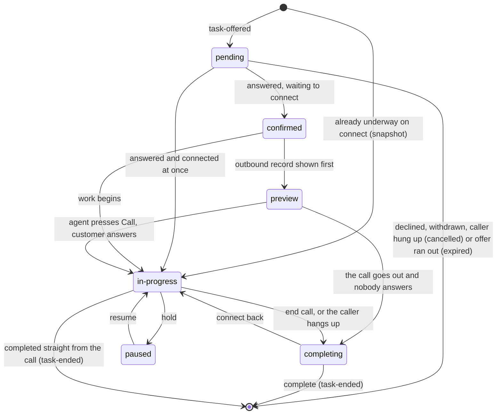
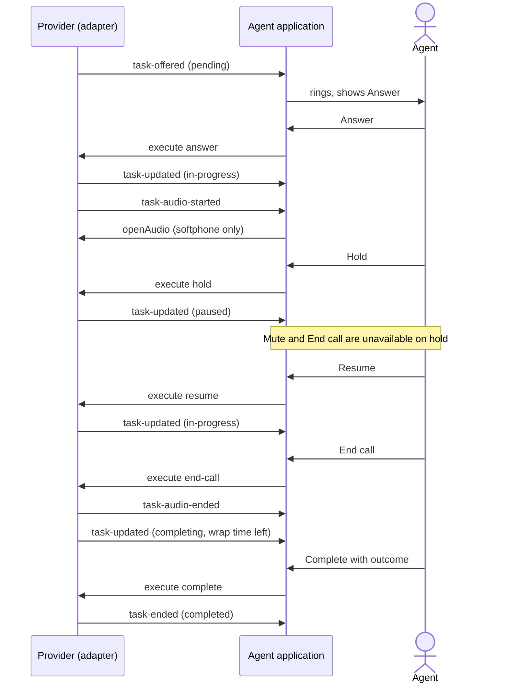
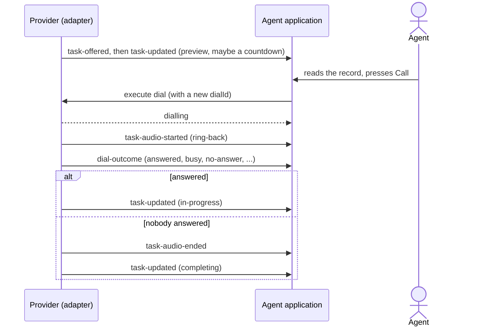

# Call flow

How one agent's part of a phone call moves, from the offer to the moment it leaves the agent's
screen. Terms are in `GLOSSARY.md`; the rules are in `guide.md`, `guide/agent.md`,
`guide/voice.md` and `guide/phone.md`.

## Where a call task stands

| Phase | What the agent sees | Default label |
| --- | --- | --- |
| `pending` | The phone rings, with Answer and maybe Decline. | Offered |
| `confirmed` | Answered, waiting for the call to connect. Many platforms skip it. | Accepted |
| `preview` | An outbound customer's record, with a Call button and maybe a countdown. | Preview |
| `in-progress` | On the call. | On Call |
| `paused` | The caller is on hold. | On Hold |
| `completing` | The caller is gone; the agent finishes notes and picks an outcome. | After Call Work |

## An inbound call on the wire

## An outbound preview call

When the countdown runs out, `atDeadline` says who acts: the provider dials (`provider-dials`),
the agent application dials (`host-dials`), or nobody does and the record waits (`waits`).

## Rules worth knowing

- **Every offer is owed an ending.** Whatever happens to the call, the provider sends `task-ended`.
- **Every dial has exactly one outcome.** A dial answered `dialling` always gets its `dial-outcome`.
- **Audio follows the task, never the other way round.** A dropped stream changes nothing until the provider says so.
- **No End call from hold.** Resume first; `terminate-call` may end everything, held caller included.
- **No Mute from hold on a softphone.** A mute already on when the hold began stays on.
- **No transfer.** Help comes from a lead: listen, coach, join the call, or take it over.
- **A callback carries the call it comes back to.** Its task's history starts with the earlier call's steps.
