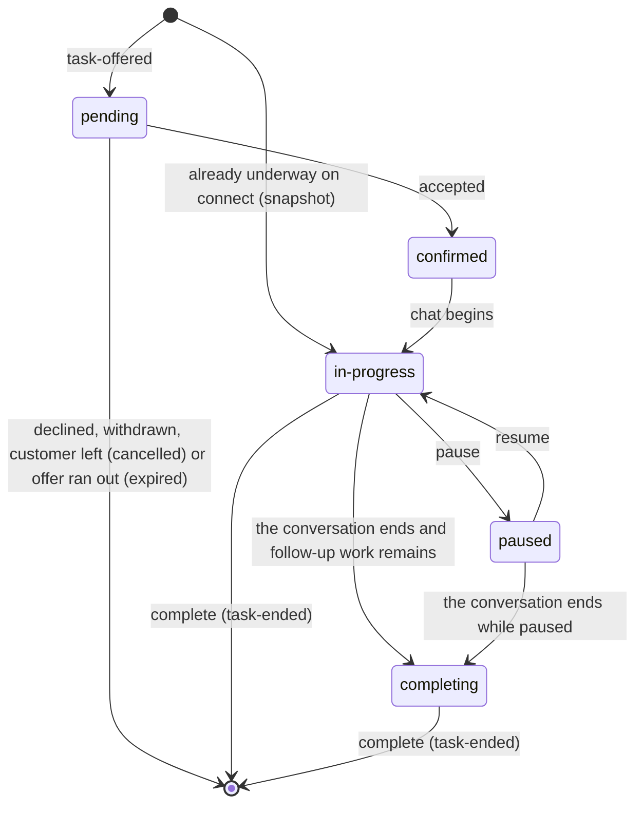
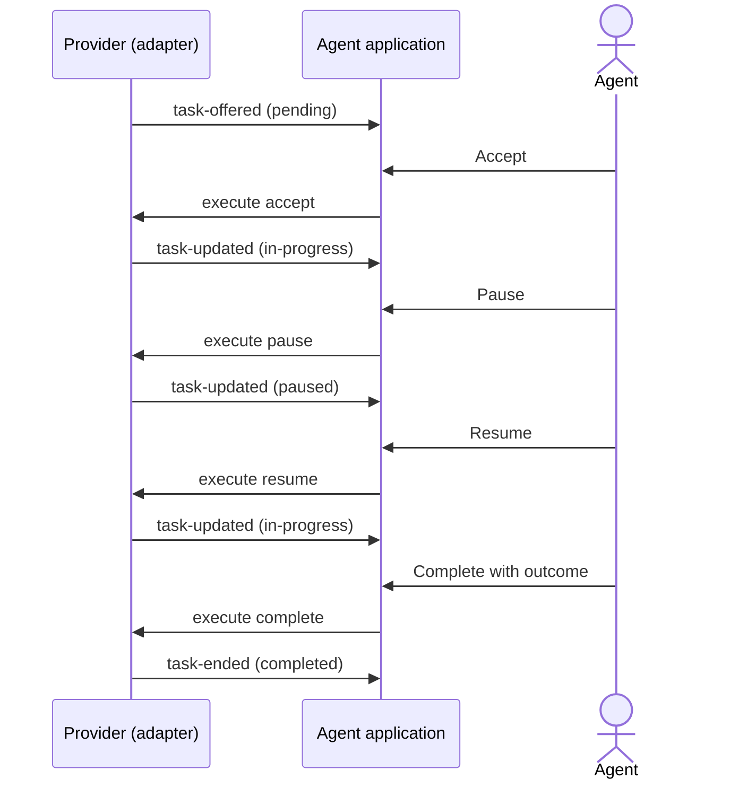

# Chat flow

How one agent's part of a chat moves, from the offer to the moment it leaves the agent's screen. A
chat has no call: no audio, no phone, no preview. Terms are in `GLOSSARY.md`; the rules are in
`guide.md`, `guide/agent.md` and `guide/chat.md`.

## Where a chat task stands

| Phase | What the agent sees | Default label |
| --- | --- | --- |
| `pending` | A new chat flashes, with Accept and maybe Decline. | Incoming Chat |
| `confirmed` | Accepted, waiting for the chat to open. | Accepted |
| `in-progress` | Chatting with the customer. | In Chat |
| `paused` | The chat is paused; the customer waits. | Paused |
| `completing` | The customer is gone; the agent finishes notes. | Wrap-up |

## A chat on the wire

## Rules worth knowing

- **One agent can hold several chats at once.** How many is the agent's capacity on this provider.
- **A chat is completed from where it stands.** There is no call to end, so the agent completes from `in-progress`, or from `completing` where the provider moved it there.
- **Pause is the chat's hold.** The `hold` capability offers it; the command is `pause`, then `resume`.
- **Every offer is owed an ending.** Whatever happens to the chat, the provider sends `task-ended`.
