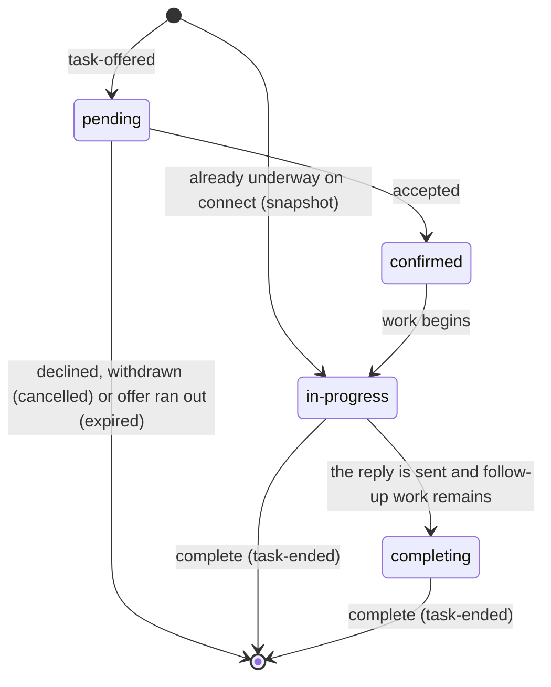
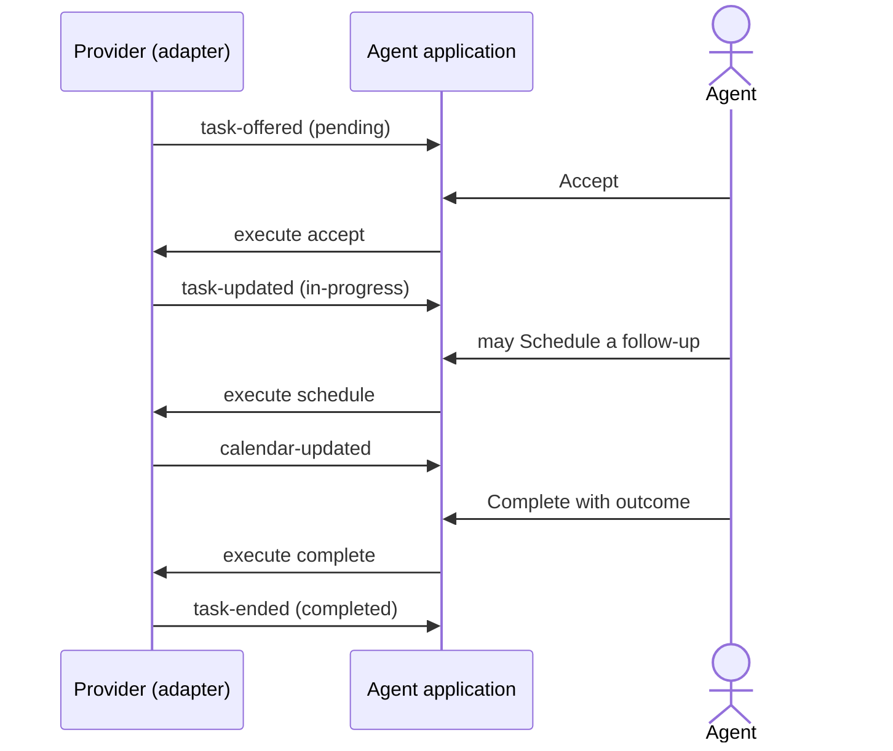

# Email flow

How one agent's part of an email moves, from the assignment to the moment it leaves the agent's
screen. An email has no call and no pause: it is worked and completed. Terms are in
`GLOSSARY.md`; the rules are in `guide.md`, `guide/agent.md` and `guide/email.md`.

## Where an email task stands

| Phase | What the agent sees | Default label |
| --- | --- | --- |
| `pending` | A new email is assigned, with Accept and maybe Decline. | Assigned |
| `confirmed` | Accepted, waiting to open. | Accepted |
| `in-progress` | Reading and replying. | Working |
| `completing` | The reply is done; the agent finishes notes. | Completing |

## An email on the wire

## Rules worth knowing

- **No hold, no pause.** An email waits on its own; there is no `hold` capability on email.
- **An email is completed from where it stands.** The agent completes from `in-progress`, or from `completing` where the provider moved it there.
- **A follow-up goes on the calendar.** `schedule` puts it there, from the email or from its wrap, where the provider declares a calendar.
- **Every offer is owed an ending.** Whatever happens to the email, the provider sends `task-ended`.
